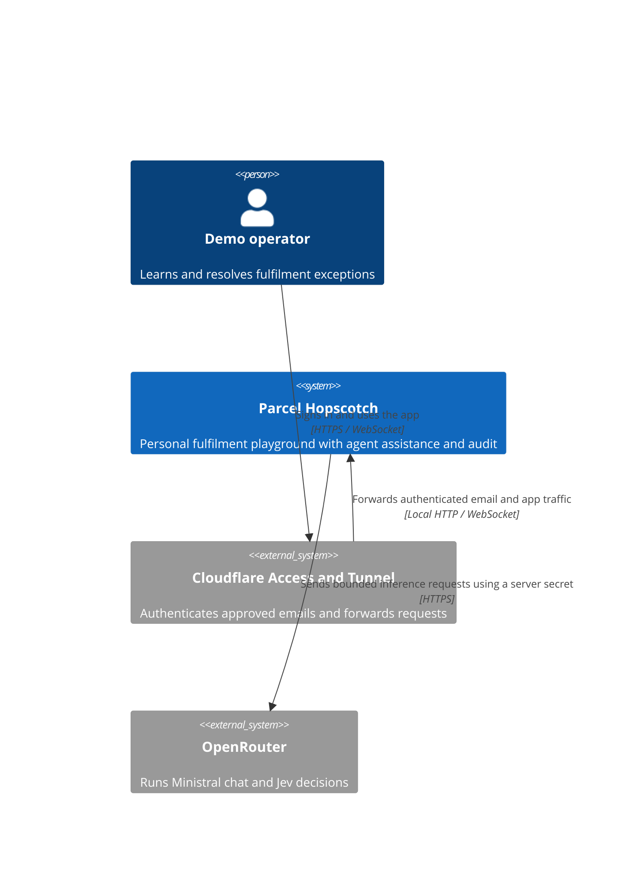
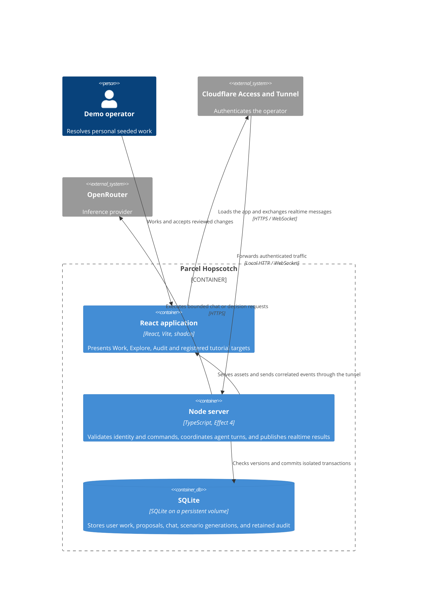

# Parcel Hopscotch architecture

A person supervises a synthetic fulfilment queue using ordinary controls or a small embedded agent. Server commands protect ownership and review requirements. Model outputs select permitted actions but never establish authorization.

## System context



## Containers



## Server responsibilities

- Identity and realtime transport derive the user, validate messages, correlate requests, manage reconnects, and reject expired reset generations.
- Fulfilment commands own rules, proposals, atomic acceptance, Undo, seed data, and reset. They are independent of models.
- The tool registry supplies typed input/output contracts, permitted effects, and Explore examples.
- The agent runtime coordinates bounded turns and validates every requested tool. UI guidance addresses registered target IDs and advances tutorials from verified app events.
- OpenRouter adapters normalize chat and decision responses, cancellation, failures, usage, and actual billing data.
- Audit records provider attempts and app outcomes using allowlisted payloads and complete-duration measurements. Its request list groups calls by owner, generation, and agent turn ID before pagination, returns every call for the selected requests, and uses retained completion records for request outcomes and send-to-completed-work duration.

Keep these responsibilities as plain modules in one application. Separate packages only when a concrete reuse need justifies them.

## Exploratory QA tooling

`tools/qa-loop` contains the reusable manual QA workflow, role instructions,
validated run records, and selected memory promotion. `qa/definitions` supplies
this application's synthetic persona, open-ended missions, and independent
expected outcomes. `qa/parcel` starts a disposable local instance and provides
recorded browser actions and verifier-only state checks. `scripts/qa.mjs` joins
them into one session with an app spending threshold and wall-clock deadline.
Production application modules do not depend on these tools. See
[exploratory QA](exploratory-qa.md) for invocation, trust boundaries, and evidence.

## Guided help

The helper reads a bounded semantic description of the current view. The
application supplies registered targets, evaluated action availability, and
relevant failure facts. Neither model prompts nor guide placement need an HTML
dump or screenshot. React refs provide target geometry inside the browser.

`src/guidance` owns versioned contracts and pure session transitions. Work and
Audit own their public guide definitions in `src/modules`. The composition file
passes those definitions to the application. The client renderer receives
targets and navigation callbacks; it has no business command dispatcher.

An offer becomes a guide after the person chooses Show me. Notes point to the
current task, and the Task trail retains the origin while the person moves.
Progress requires an application result or mounted target with the expected
session, entity, operation, context, and generation. Browser-local continuation
data resumes paused after a reload. Reset invalidates it. Guidance never grants
permission to prepare or accept changes.

The model tool registry validates guidance requests and restricts guidance
turns to read and guidance capabilities. The server derives stale-review facts
from the rejected transaction. Existing order and stock version checks remain
the authority for acceptance. Returning from a stale review brings the person
to a place where they can request a fresh review.

CI checks resolved TypeScript imports to keep the runtime independent of
business modules and to keep module internals private. Component contract tests
check the targets that actually mount. Transition and transport tests cover
correlation, stale references, and unsupported continuation versions. See
[guidance](guidance.md) for the experiment and extension rules.

## Review and reset ordering

```mermaid
sequenceDiagram
  participant U as User
  participant W as React UI
  participant N as Node commands
  participant D as SQLite
  participant M as Agent
  M->>N: Prepare typed change for current user
  N->>D: Read current versions and generation
  N-->>W: Exact proposal and consequences
  U->>W: Accept proposal
  W->>N: Accept opaque proposal ID and idempotency key
  N->>D: Verify owner, generation, versions; commit atomically
  D-->>N: Receipt or stale rejection
  N-->>W: Publish committed state or refreshed-review requirement
  U->>W: Confirm prepared reset
  W->>N: Accept reset
  N->>D: Increment generation, restore seed, retain audit
  N-->>M: Cancel old-generation work
  N-->>W: Reset snapshot and completion receipt
```

There are no unresolved product decisions. OpenRouter credentials are supplied locally, and production tunnel settings belong to deployment after the owner's audit.
