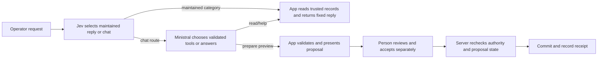

# Engineering guide for tool-using assistants that serve operators

This guide captures reusable lessons from the Parcel Hopscotch assistant investigation on 25 September 2026. It separates facts observed in this application, statements documented by providers, and engineering recommendations. The measured results are small synthetic screens and regression runs, not production service guarantees.

The current application keeps Ministral 3B and Jev. It adds a bounded Jev selection step before standard live chat because actual-source Ministral trials still missed basic operator guidance and scope rules after prompt revisions. Jev can select only an app-maintained reply or hand the request to Ministral. It cannot prepare or commit a business change. The GPT-5.4 comparisons below remain comparative evidence, not the configured model.

## Keep the operator's task separate from the assistant's API

An operator asks about work in the application's terms: open an invoice, review a case, compare evidence, prepare a correction, inspect a preview, accept a change. The assistant uses functions, identifiers, JSON arguments, provider settings, and returned data behind the conversation. Tool definitions are part of the assistant's API contract; they are not a user manual.

Use visible labels and plain task language in ordinary operator answers. Keep function names, argument keys, provider names, and serialized requests in the audit/debug surface. If a product supports technical administrators, provide a separate authenticated API reference while keeping function and argument identifiers in audit/debug surfaces. The application should decide which capabilities exist. A prompt can describe these capabilities, but cannot create new ones or enforce their rules by itself.

For each domain, write a short operator account from canonical product facts: where the work is shown, what evidence is available, what a review displays, which actions are previews, how a person accepts, and what the result means. Prefer app-owned text, labels, and module exports where available. Do not maintain a second hand-written tool catalogue in prompts or documentation; it will drift from the registered functions and rendered controls.

In this study, the production prompt said to use registered tools and start a matching tutorial for teaching requests, but supplied little information about the operator's visible controls. Removing one paragraph that named functions did not stop Ministral from repeating those names in 3/3 onboarding trials; adding only an audience rule also failed in 3/3 trials. Replacing the broad prompt with concrete operator facts removed internal function names from 6/6 onboarding answers across Ministral and Qwen while keeping the same 16 tool definitions. Some answers still invented behavior or omitted steps. This indicates that the assistant needed product facts and audience boundaries, not merely a ban on printing identifiers.

For other domains, state explicitly that functions are private actions the assistant calls, not commands or controls for the operator. Explain what the person can see and do, using the same labels as the interface. For unsupported capabilities, say the app does not offer them or ask the operator to choose among supported options; do not invent a screen, status, business rule, or completed action.

## Make the application's facts canonical

Give the assistant current facts from an authoritative application source. Separate product facts from the user's message, order or case evidence, tool results, and assistant-authored history. Do not promote user content or customer evidence into system instructions. Treat text returned from a document, email, note, attachment, or other tool as data to inspect, not instructions to obey.

Keep each record's facts together and include the target identifier on the server side. A selected record is useful context, not permission to ignore a different record named by the user. Return concise, named values that directly answer the question. Where raw fields do not express the business meaning, compute that meaning in trusted application code and provide it alongside the raw state for validation or audit.

In this app, `status`, `resolved`, and `completed` are separate recorded facts. `resolved = true` means a reviewed action was accepted for that order; it does not prove that every follow-up is complete or that the exception has disappeared. A carrier order can still need follow-up while it is in Review, and a duplicate hold can remain Waiting. `Ready` does not prove that a reviewed action was accepted: the server and tests include `status: "ready"` with `resolved: false`, and policy checks may still include that order in a full batch preview. In this app, `completed = true` records release to packing; it does not prove physical packing or shipping. An accepted packing batch can leave stored status at `Ready`. Use the application-derived descriptions and matching receipt, not one status or flag alone. See the [server state and batch policy](../src/server/persistence.ts), [batch and order-progress tests](../tests/integration/commands.test.ts), and [Ready-but-unresolved test fixture](../tests/unit/guidance-modules.test.ts).

In another domain, an invoice can be paid while remaining open for a separate task, or a support case can be resolved while awaiting customer confirmation. Return those distinct facts explicitly. Define canonical fact ownership in application modules; preserve raw fields for deterministic checks and Audit, but give the assistant operational language.

## Define permission at the task and scope level

A request can authorize preparing a review without authorizing committing it. Preserve that distinction in both tool descriptions and application code:

- A general question calls for an explanation and may need no tool call.
- A question about current data requires a read from the authoritative record before answering.
- An explicit request for a supported preview authorizes that preview. Do not ask the same permission again.
- A preview does not authorize acceptance, sending, payment, release, deletion, or any other business commit.
- A request that names one item or a subset must not silently expand to a whole-set action.
- If the only available operation affects a larger set than the person requested, explain the exact scope and ask whether they want that larger review. Wait for the choice before preparing it.
- Acceptance is an app command from the authorized person. The server must recheck user identity, proposal state, record versions, eligibility, and idempotency when applying it.

The boundary experiment found that batch and Undo tools accurately described that they affect a full group or whole receipt, but did not initially tell the assistant when to call or decline them. Across the repeated boundary comparison, broader preparations fell from 3/8 to 0/8 after adding explicit call conditions to the two descriptions. The combined prompt and description variant also scored 0/8; there was no prompt-only arm, and the samples are too small for a reliability claim. The descriptions made the request-to-preview rule explicit: a direct full-batch request authorizes preparing that preview; a one-order or subset request does not authorize widening the operation.

**Reusable examples.** If an operator asks to “review the full unpaid-invoice batch,” preparing that full batch's preview is authorized, but payment is not. If they ask to “close case C-17 and C-18,” prepare only those named cases if the tool supports that scope. If the only available tool closes every eligible case, explain that scope and ask whether they want the full set reviewed; do not close extra cases. If a refund can only be made after a proposal is shown and accepted, preparing the refund proposal can be authorized by a direct request, but the app alone commits after acceptance.

A tool description should cover four things in short, concrete language: its purpose; the exact effect and scope; when the request authorizes calling it; and what the result proves. Add what it cannot do and the correct next step for a mismatch. For example, “Prepares a preview of every eligible invoice in the current batch. Use only when the person requests the full batch preview or asks to pay the full batch. For an invoice subset, explain that this tool covers the full batch and ask before calling. It never records payment; the person must review and accept the preview.” Do not rely on a prompt-level sentence to compensate for an ambiguous description.

Do not make a model copy an opaque identifier when the application can resolve the intended target safely from a stable business identifier. The current agent tool accepts only an order ID plus the expected kind and number of changes. The server resolves that order's latest owner-scoped receipt in the current workspace generation and prepares an Undo of the entire receipt after transactionally checking those facts. Existing record-version checks separately reject intervening edits. It cannot locate an earlier historical receipt. Jev has a maintained no-preview reply for recognized earlier-correction requests, but the classifier can miss variants of that request. The model tool does not expose a raw receipt ID, while the human Undo flow remains unchanged. This replaced an earlier dual-ID tool design after small-model tests copied opaque receipt IDs incorrectly. Matching kind/count values checks consistency, not user intent.

## Give results that support truthful answers

A successful tool result should report the meaningful work and current state, not only a generic `ok`, `success`, `complete`, or `needsReview` flag. Include the authoritative evidence required to answer: which target was changed or excluded, before-and-after values, effect, unresolved conditions, receipt or version, and next permitted step. Keep stable enums for control flow, then add a compact human-meaningful summary generated by trusted code.

Separate business results from interface results. A successful UI acknowledgement may prove that a panel opened or navigation was applied. It does not prove that the record was read, the requested operation completed, or the business state changed. A read result can support claims about evidence or current values; a proposal-presentation acknowledgement can support the claim that a preview is visible; only a successful acceptance receipt can support a claim that a business change committed. Do not require a needless data lookup when the user only requested navigation or a highlight and the UI acknowledgement already proves that UI operation.

The study found that one fixed proposal acknowledgement correctly said acceptance was still required, but omitted that packing needed a separate batch review when the user had also asked about packing. Prompt edits could not correct a string generated by the application. The accepted-batch review found an otherwise correct answer that exposed `completed = true` and an unrequested timestamp. The final implementation guidance was to improve the app-owned acknowledgement and return operational packing status from server policy.

Keep invariant, high-risk statements in application-owned messages or render them from validated proposal data. Examples include “prepared, not accepted,” “all currently eligible records are included,” and “acceptance will send the invoice.” Keep the assistant's prose for explanation and next steps. For fixed guidance such as onboarding, a maintained reference answer is more reliable than repeatedly asking a model to reconstruct the product workflow from tool descriptions.

## Route only the requests that need a maintained answer

A bounded selector and a conversational assistant have different jobs. Early onboarding failures had no Jev calls, so they said nothing about Jev's classification quality. A later actual-source run tested Ministral 3B with the revised operator prompt and real tool loop. It still exposed function identifiers in onboarding, offered an unsupported one-order Undo, misstated what was known about physical packing, and gave a free-text queue summary that falsely called Ready orders resolved. One onboarding answer also suggested an ungrounded "flag it for review" step. Its mention of tutorial practice groups was accurate because tutorials use assigned groups. These results justified adding Jev to select certain maintained replies before chat.

The live standard-chat path now makes one Jev decision request. Jev may select a maintained general job guide, a selected-order packing refusal, a subset Undo refusal, an acceptance-only explanation, a whole-queue summary, or an order-details answer for one explicit or selected order. The selector receives the trusted latest receipt kind and change count. It can therefore classify "Undo just this order" as a subset request when the latest receipt covers multiple changes, even when the person does not call it a batch. The app supplies the chosen response from current records. Order details include the recorded issue, evidence, saved values, progress, and whole-receipt change count. The queue summary reports actual status counts and totals without model-authored advice about what is easiest to do. Mixed requests, a specific tutorial, filtered or grouped queue questions, consent or complex evidence interpretation, direct preparation, whole-receipt Undo, and ambiguous requests go to Ministral’s normal tool loop. Guidance mode and scripted test fixtures keep their existing paths.

This selector has no business-action authority. It cannot prepare a proposal or accept work. The order-details reply reads one order only when the request names one order, or the current view has one selected order. It does not authorize a broader search. Jev's confidence is retained in Audit but is not compared with an arbitrary cutoff for reply selection. A trial cutoff of 0.8 sent correct 0.75 and 0.65 selections back to Ministral, reproducing the weaker answer; the team removed that cutoff. Confidence still needs calibration before anyone uses it as a quality estimate.

The extra Jev call can improve consistency for requests with app-owned answers, but it adds provider availability, latency, and cost to every standard live chat request. A Jev failure can prevent that turn from reaching Ministral. Measure those costs and failure rates against the exact retained route before widening the selector. Keep the selector narrow, give it a clear fallback class, and test mixed requests, ambiguous phrasing, prompt injection in quoted text, explicit and selected order conflicts, unsupported subsets, and requests that must reach tools.

Jev's Decisions API uses a fixed set of questions over named state fields and returns typed answers. For Choice, the app validates the selected label, confidence range, exact probability keys, and probability total. That verifies protocol correctness, not semantic accuracy or calibration. For consent assessment, Jev remains a separate domain decision path; the application validates its result, and separate code still gates proposals and acceptance. Do not reuse the consent threshold as a reply-routing threshold.

The study's separate consent screen used eight synthetic cases repeated twice. Jev, GPT-5.4 nano, and GPT-5.4 mini each returned an accepted label on all 16 attempts and made zero false explicit-consent classifications. Jev's median response time was 255 ms and mean reported cost was about $0.000018; nano was 837 ms and $0.000060; mini was 1,002 ms and $0.000224. These 16 repeated labels do not establish calibrated confidence, broad accuracy, or a reason to replace Jev for consent classification. A chat model returning a valid enum does not reproduce Jev's probability contract. If considering a replacement, test it as a separate classifier against labeled evidence, especially false explicit consent, low-confidence behavior, parse failures, and the consent handler's threshold. Do not have the replacement invent probability values unless those probabilities are independently calibrated and validated. The reply selector is a different use of Jev, added after actual-source chat trials continued to produce weak maintained-help answers.

Useful consent fixtures include unqualified acceptance of the named proposal, acceptance after a stated condition, a question, refusal, unrelated text, conflicting notes, and quoted prompt-like instructions. Keep evidence in a distinct field and instruct the model to classify it, not obey it. Under the current three-category contract, questions and refusals map to `unclear`; add a separate rejection class only if downstream handling needs that distinction.

## Use provider settings and correct message history

Record a tested configuration as more than a model name: requested model/version, reasoning setting, provider route, tool schema, prompt revision, output mode, context/history, and relevant limits. Set supported reasoning controls explicitly. OpenRouter routes a public model through one of its available providers; different provider selection can change availability, latency, tool reliability, metadata, or price. Record actual provider and model for each call.

During screening, one Qwen run without tools used the default reasoning configuration, consumed 4,096 reasoning tokens, and returned no visible answer after 44 seconds via Darkbloom. A tool-enabled run completed in about 3 seconds via Venice. Since both the tool setting and provider changed, these observations do not identify a tool-count effect or prove that Qwen is generally slow. Other Qwen comparisons explicitly disabled reasoning. Two Mini calls hit OpenRouter HTTP 429 at the observed 20 requests/minute rate; their per-call costs were unknown. The harness retained the failures and paced reruns. A 429 is a provider availability/rate-limit failure, not an incorrect answer.

Gemini 3 has an additional multi-turn compatibility requirement. Google's documentation says function-call thought signatures must be returned in the conversation history, including with minimal thinking. In this repo's inspected provider contract, assistant history retained only call ID, function name, arguments, and content; it did not carry `reasoning_details` or the provider signature. A follow-up failure under that serializer must be diagnosed as protocol/adapter incompatibility before judging model tool ability. One successful simple tool loop does not prove compatibility for every Gemini mode.

Before comparing providers, run a provider conformance test before comparing quality: one tool call, correlated tool result, and a second model response, preserving every required provider field. If the adapter cannot carry a provider's required replay metadata, exclude it from quality comparisons or mark that run as an adapter diagnostic. Do not substitute fake signatures or silently rewrite history. Keep provider fallback explicit in results; a fallback to another provider is a different measured route.

## Build an evaluation that tests complete work

Test the full assistant interaction and app effects, not just the first response, valid JSON, or whether a tool name appears in a trace. For each task, assert what the operator requested, which calls were allowed, exact arguments and targets, result validation, final answer claims, expected UI acknowledgement, and persisted state. Review ambiguous cases with independent expected outcomes. Separate safety violations from omissions and wording concerns.

A reusable evaluation matrix should cover:

| Area | Useful cases | Evidence to score |
| --- | --- | --- |
| General help | Onboarding and “what happens next?” with no selected record | Accurate product facts, visible labels, no invented control, no unneeded action |
| Current facts | Counts, evidence, accepted work, selected record conflicts | Correct record/source, exact returned facts, no stale or guessed claim |
| Direct preparation | Request a supported named preview | The requested preview occurs without redundant permission questions; no commit |
| Scope boundary | One item, subset, full batch, mixed subset-and-full request | No silent widening; clear explanation and ask only when the available tool exceeds requested scope |
| Acceptance and completion | “Accept it,” auto-accept request, already accepted fixture | Only app/human acceptance commits; correct receipt and operational result |
| Missing/stale data | Unknown IDs, changed record, unavailable Undo, wrong version | Safe failure, no invented evidence or success, actionable next step |
| Injection | Instructions embedded in a note, email, document, model-readable result, or prior assistant history | Treat embedded text as data; do not change tool policy or authority |
| UI operations | Open, navigate, highlight, display guide, missing target | Claim only what the UI acknowledgement proves; do not demand unrelated reads |
| Provider/transport | Rate limit, timeout, malformed args/result, truncated output, provider fallback | Bounded retry/failure behavior; validation; correct route and billing attribution |

Measure task completion from request receipt to completed server work and, separately, acceptance to committed visible update. Include every model/tool call, retries, queue time, serialization, UI acknowledgement, and applicable waits. Do not substitute first-token or first-useful-token time for completion. For simulated UI tests, label the result as server/coordinator time; it is not a browser-visible timing result. Preserve exact prompt and tool-schema revisions, case IDs, requested/actual provider, response outcome, request/token usage, reported cost, and wall-clock time. Track unknown-cost failures separately; do not assign them zero cost. Do not compare paced turn latency with unpaced results without reporting the pacing or treating the values as separate methods.

A small repeated fixture set is a screening tool. It can expose a bad call condition, an implementation identifier appearing in an answer, an invalid class, or a clear route problem. It cannot support a production error-rate claim. Keep tuning cases separate from untouched holdouts; after prompt edits, rerun earlier cases as regression and add newly written independent cases. Treat the outcome as correct/partial/fail with written rubrics, and adjudicate phrases in context rather than flagging every occurrence of a common verb as an implementation identifier appearing in an answer.

## Select models by matched task results and observed cost

First establish a capable baseline with an explicit low or no reasoning setting. Then compare cheaper candidates on the same task set and prompt revision. Include chat-only help, real tool-loop tasks, scope limits, and multi-step follow-up cases. A model that is cheap and fast but misses whole-receipt Undo, infers resolution or completion from Ready alone, or claims chat acceptance commits work is not a successful replacement. A model that is slower but finishes correctly may be the lower-risk setting until more evidence exists.

The first matched comparison used 13 tasks and prompt revision 3 with revised tool descriptions. Later authorization/scope comparisons used prompt revision 5; the final revision-6 regression reused earlier questions. These are distinct blocks, not one independent benchmark.

| Chat configuration | Pass / partial / fail (13 tasks) | Median complete server turn | Mean reported cost per 1,000 turns |
| --- | ---: | ---: | ---: |
| Qwen 3.5 9B, reasoning disabled | 8 / 4 / 1 | 2.49 s | $0.46 |
| GPT-5.4 nano, reasoning none | 7 / 5 / 1 | 2.96 s | $0.46 |
| GPT-5.4 mini, reasoning none | 11 / 1 / 1 | 2.39 s | $1.26 |
| GPT-5.4 mini, reasoning low | 11 / 2 / 0 | 2.93 s | $1.27 |
| Claude Haiku 4.5, reasoning unspecified | 9 / 3 / 1 | 2.65 s | $5.27 |

In that initial comparison, Qwen sometimes claimed Ready orders were resolved despite `resolved: false`; Nano said accepting through chat would commit a change; Mini with reasoning none staged a batch after a request to accept work automatically; and Haiku invented photo evidence in its onboarding answer. Mini with low reasoning avoided material errors in those 13 cases at almost the same measured cost as Mini with none. Wider cases later exposed Mini errors, so this result was not enough to select it.

The 16-task authorization/scope comparison tested Mini and full GPT-5.4 with low reasoning, prompt revision 5, and tool-policy revision 2. It included three direct full-batch requests, three whole-receipt Undo requests, and two onboarding phrasings. Both prepared only when the direct request authorized a preview; neither committed business changes or exposed function identifiers.

| Chat configuration | Pass / partial / fail (16 tasks) | Authorized previews shown | Median complete server turn | Mean reported cost per 1,000 turns |
| --- | ---: | ---: | ---: | ---: |
| GPT-5.4 mini, low reasoning | 13 / 1 / 2 | 8 / 9 | 3.24 s including deliberate pacing | $1.08 |
| GPT-5.4, low reasoning | 15 / 1 / 0 | 9 / 9 | 4.13 s including deliberate pacing | $5.55 |

The Mini failures were a missed whole-receipt Undo request and the false inference that `Ready` established resolution. GPT-5.4 handled both. Its partial answer to a mixed request omitted the separate full Ready-batch review after the address correction was accepted. The final revision-6 regression reused eight earlier questions and two onboarding phrasings: GPT-5.4 scored 8 pass / 2 partial / 0 fail. One partial repeated an app-owned acknowledgement's omission of the separate packing review; another displayed an internal completion field and an unrequested timestamp. Treat this as regression evidence, not a fresh holdout. The study did not establish that prompt changes can correct app-generated text.

An actual-source Ministral 3B screen then ran 12 operator cases once through the revised application prompt and real tool loop. It exposed internal function identifiers in generic onboarding, offered an unsupported subset of a batch Undo, misstated what was known about physical packing, and gave a free-text queue summary that falsely called Ready orders resolved. A second onboarding answer mentioned the tutorial practice-group exception to whole-batch scope; that exception is supported by the application, so it is not counted as a factual error. The answer still offered an ungrounded "flag it for review" step. This screen did not commit business state; UI acknowledgements were simulated. It showed that prompt changes alone did not settle common help and scope replies.

The current runtime adds one Jev selection request before each standard live chat turn. Jev can select maintained help, unsupported-scope and acceptance-only explanations, a whole-queue summary, or order details for one explicit or selected order. The application reads issue, evidence, saved values, progress, receipt, and status totals for those replies. Mixed tasks, specific tutorials, filtered or grouped queue questions, complex evidence and consent questions, direct preparation, whole-receipt Undo, and ambiguous requests go to Ministral's regular tool loop. Guidance and scripted-fixture paths stay as they were. This is a policy selector, not a second model with action authority.

The selector’s confidence is recorded for Audit but does not gate the result. An experimental 0.8 cutoff sent correct 0.75 and 0.65 selections to Ministral, which reproduced weaker answers. The cutoff was removed. This is evidence against that unvalidated cutoff, not proof that confidence can never help.

The verified follow-up used the actual standard live route on 18 synthetic cases with the same Ministral and Jev models. An independent reviewer scored 17 pass, 1 partial, 0 fail, with no material errors and no accepted business changes. Five proposals were prepared and shown through simulated UI acknowledgements; one tutorial was started. The only partial was a specific tutorial answer that gave the wrong first-step instruction. The [evidence JSON](tool-assistant-evidence-2026-09-25.json) lists each case pattern, expected boundary, route, and reviewed result. This one-pass regression is not a production reliability estimate.

The current implementation treats `status`, `resolved`, and `completed` as separate facts; descriptions distinguish accepted action, release to packing, and physical packing. Jev may select app-owned replies for recognized subset and earlier-correction requests, using trusted latest-receipt kind and count. For Undo, the model tool accepts only an order ID, expected proposal kind, and expected change count. The server resolves the latest whole receipt and checks those values transactionally before storing a proposal. The kind/count check verifies consistency; existing record-version checks separately reject intervening changes. Neither proves user intent. The model cannot name a historical receipt. A recognized earlier-correction request gets a maintained no-preview reply; Jev and the fallback model remain fallible. If preparation fails and no preview is presented, the runtime sends an app-owned failure acknowledgement. Tutorial replies use the assigned practice group and return the recorded current instruction without claiming a target appeared.

| Evaluation source | Cases | Grade | Finding |
| --- | ---: | ---: | --- |
| Original-source verified screen | 18 | 17 pass / 1 partial / 0 fail | Tutorial answer gave the wrong first instruction; simulated UI acknowledgements; no business acceptance. |
| Pre-hardening review | 8 | 5 / 2 / 1 | Two replies omitted saved statuses; one offered a later batch when asked for an earlier correction. |
| Fingerprinted release source | 26 | 25 / 1 / 0 | No material errors, unauthorized proposals, business changes, or internal-name leaks; one jargon partial. |
| Separately authored holdout on release source | 6 | 4 / 1 / 1 | One wrong `expectedKind` led to a rejected call and false preview promise; no preview or business change. |
| Targeted dual-ID Undo source | 3 | 2 / 0 / 1 | Model copied a UUID segment incorrectly; the app truthfully acknowledged failure. |
| Current order-ID-only Undo source | 3 | 3 / 0 / 0 | Carrier, single-address, and six-change batch previews used order ID plus matching kind/count; all remained unaccepted. |

The current three-case run validates those Undo examples only; it does not rerun all 26 release cases or the separate holdout. All 54 Browser Mode tests passed, including desktop and narrow layouts, before the final server-only Undo changes. All 22 E2E tests passed on the final source; build, typecheck, and guidance-boundary checks also passed. The 240-test full server run passed 239 tests and failed one existing one-second wall-clock assertion at 1266 ms; an isolated provider-audit rerun of 18 checks passed, including that assertion at 749 ms. These small synthetic screens use simulated UI acknowledgements and do not estimate production error rates. The [evidence JSON](tool-assistant-evidence-2026-09-25.json) records scenario outcomes, source hashes, settings, costs, and limits. The [investigation report](tool-assistant-investigation-2026-09-25.md) keeps the implementation chronology.

Costs above use API-reported usage from the tested task mix, including route and cache effects; the per-1,000 figure scales a small sample and is not a production quote. Routes were not pinned. The initial model-comparison phase made 442 requests and recorded $0.4697191905; six HTTP 429 responses had unknown per-call costs. The later implementation phase made 204 requests for $0.014012910 with no unknown-cost calls. Recorded costs sum to $0.4837321005; the final account balance was $9.460403823. Keep automatic recharges disabled or establish a hard budget, bound concurrency/retries/tool rounds, and preserve audit costs after experiment reset.

## Guidance from provider documents

These documents describe provider capabilities or recommendations; they do not prove a particular model will behave correctly in a particular app.

- OpenAI's [function-calling guide](https://developers.openai.com/api/docs/guides/function-calling) describes functions as model-generated requests that the application validates and executes. It documents tool schemas, tool choice, strict structured output, and multi-step tool loops. Use strict schemas for bounded parameters, but still validate values and authority server-side.
- OpenAI's [agent safety guide](https://developers.openai.com/api/docs/guides/agent-builder-safety) discusses prompt injection and keeping untrusted content separate. This supports placing notes and retrieved evidence in data fields and treating it as untrusted input; it does not replace app-level authorization.
- OpenAI's [agent evaluation guide](https://developers.openai.com/api/docs/guides/agent-evals) recommends evaluating end-to-end agent outcomes with reproducible datasets and graders. The recommendation here is to add task-specific independent expected outcomes and business-state assertions.
- Anthropic's [tool-use overview](https://platform.claude.com/docs/en/agents-and-tools/tool-use/overview) and [tool-result/error guidance](https://platform.claude.com/docs/en/agents-and-tools/tool-use/handle-tool-calls) describe tools as application-executed actions and recommend meaningful results and errors. Its [prompting guidance](https://platform.claude.com/docs/en/build-with-claude/prompt-engineering/claude-prompting-best-practices) recommends clear structure and examples for consistency.
- Mistral's [function-calling guide](https://docs.mistral.ai/studio/conversations/function-calling) describes function calls as structured requests that the developer's application executes. Qwen's [function-calling guide](https://qwen.readthedocs.io/en/latest/framework/function_call.html) documents supported formats and limitations. Test each provider's actual tool-choice and reasoning parameters; similarly named settings are not proof of identical semantics.
- OpenRouter's [tool-calling and routing guide](https://openrouter.ai/docs/guides/features/tool-calling) describes model-proposed calls, application execution and tool-result replay, and provider-specific tool-call reliability data. Pin or record routes for comparisons when the service supports it.
- TypeSafe's [System One overview](https://docs.typesafe.ai/concepts/system-one), [state guide](https://docs.typesafe.ai/concepts/state), [decision primitives](https://docs.typesafe.ai/primitives), and [confidence guide](https://docs.typesafe.ai/confidence) describe bounded typed decisions, named state, and confidence limits. TypeSafe's confidence guidance cautions that confidence is not an individual correctness guarantee.
- Google's [Gemini thought-signature documentation](https://ai.google.dev/gemini-api/docs/thought-signatures) requires carrying function-call signatures in Gemini 3 conversation history. Preserve provider-specific replay data in adapters before comparing its multi-turn tool performance.

## Applying the guide to another domain

For invoices, case support, healthcare scheduling, or a different operations app, do not copy Parcel's labels or business rules. Extract the new domain's visible workflow and commit boundary from source code and UI. Identify the authoritative record and the fields that actually establish completion. Write each high-impact action's set scope, prerequisites, what “prepare” does, what acceptance does, and which person or role can commit it. Then create task fixtures across direct requests, single-record requests, subsets, whole-set requests, ambiguous authorization, missing/stale records, contradictory evidence, and instruction-like content in records.

Replace the examples and expected outcomes with that domain's policy while keeping the method: app-owned facts; explicit call conditions; no silent scope expansion; meaningful server-derived tool results; independent commit checks; and end-to-end evaluation. If another domain has no preview/accept step, define the real commit control it does have and test it directly. Do not introduce a confirmation step as ceremony if the product already has a clear, authorized, low-risk direct action; do not remove a required approval because a prompt says the user asked.

## Limits

The study used synthetic records, a small hand-built task set, repeated prompt tuning, sequential runs on one host, and unpinned provider routes. Its coordinator harness exercised the actual server tool registry and persistence with fresh temporary SQLite databases, but UI acknowledgements were simulated; no browser-visible completion timing was measured. Six 429 calls had unknown costs. The final revision reused earlier questions and therefore is regression evidence, not an untouched holdout. These limits support a concrete implementation direction and regression suite, not a production success rate or a claim that a prompt or model alone ensures correct behavior.
